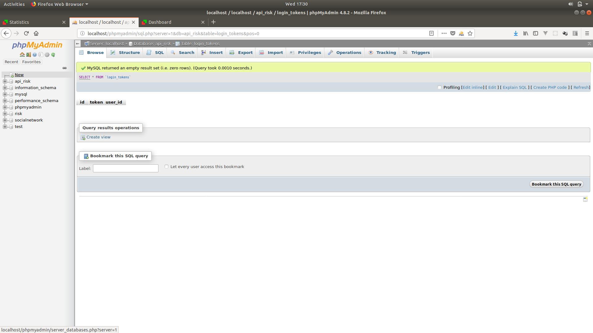
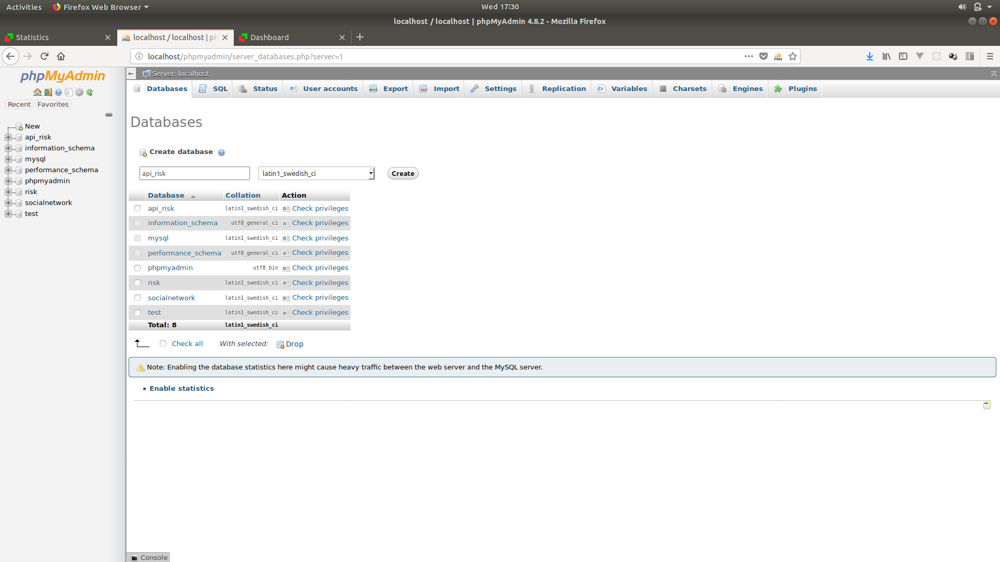
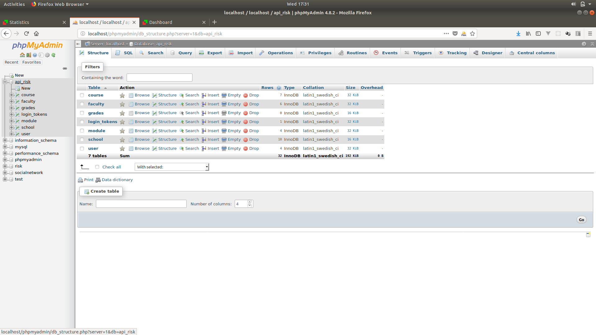
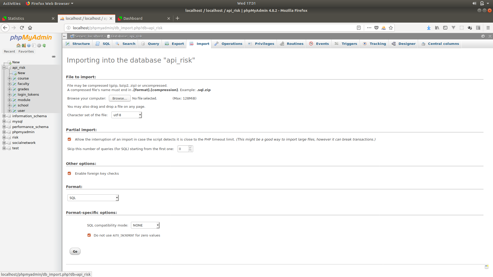
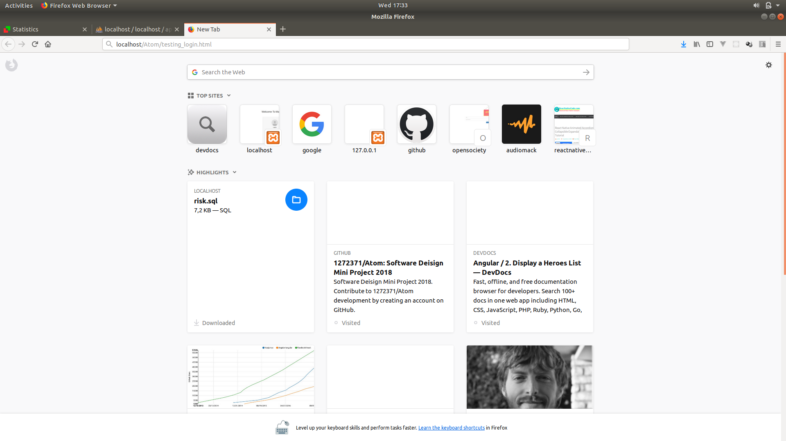

[](https://travis-ci.com/1272371/Atom)
[](https://codecov.io/gh/1272371/Atom)

## Integrate project with Git and Xampp
* Navigate to the **htdocs** in your Xampp installation folder
* If you haven't configured GitHub globally yet use
```
git config --global user.name "John Doe"
git config --global user.email "johndoe@example.com"
```
* After configurating your GitHub in the *htdocs* folder run the following commands
```
git pull origin master --allow-unrelated-histories
```
* Use the `git push -u origin master` command as `git push` will return the following error
```
fatal: The current branch master has no upstream branch
To push the current branch and set the remote as upstream, use
git push --set-upstream origin master
```

## Including Bootstrap in HTML files
Bootstrap has several files that you need to attatch in your `HTML` documents
* JavaScript files
```html
<body>
    <!--Attach this just before the closing body tag-->
    <script src="jquery/jquery.js"></script>
    <script src="bootstrap/bootstrap.js"></script>
    <script src="js/popper.min.js"></script>
</body>
```
* CSS files
```html
<head>
    <!--Attach this anywhere in the head tags-->
    <link rel="stylesheet" href="bootstrap/bootstrap.css">
</head>
```
<!---
## Restful API integration
1.Using Xampp login to phpmyadmin using your browser and navigate to the "new" tag on the left side of the screen(where your databases lie)


2.Create a new database and call it "api_risk" and click the create button


3.Click the api_risk database tab/tag that you've just created on the left side of the navigation screen(it will probably be below the "new" tag that you clicked earlier) then click on import which is usually top navigation screen(contains a red arrow that is facing leftward)


4.Now click on the browse button and navigate to the Atom(our SD project resides in this folder) folder then inside the Atom folder navigate into api then you'll find the api_risk.sql(this is the folder that you'll import into the api_risk database) file,then once you've selected the api_risk.sql file you can click on the go button at the bottom of the screen on phpmyadmin


5.On the browser,type localhost/Atom/testing_login.html(this will vary due to the fact that some users will store Atom project in a different folder or in a sub folder) and then press *ENTER*,it should now send you to the login page that communicates with the restful api  the username and password is 123456.You can you can also test it with incorrect information,so that you can get a response from the backend i.e Incorrect password or user does not exist responses


6.NB! Since we're temporarily running everything locally you should store the Atom folder in your htdocs so that the apache server can locate it when you call it via localhost/Atom/...(this will vary due to the fact that some users will store Atom project in a different folder or in a sub folder)
--->
## Technologies/Softwares that are using
1.Apache server
2.PHP programming language
3.Mysql Database

Locally we'll be using the XAMPP software which consists of the LAMP/WAMP stack
